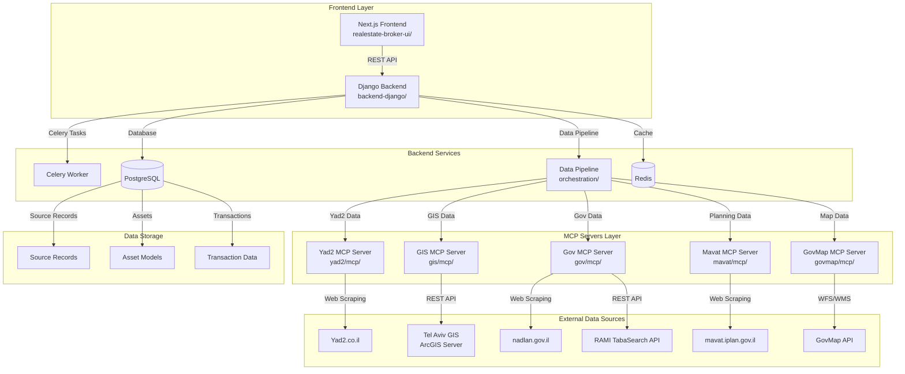
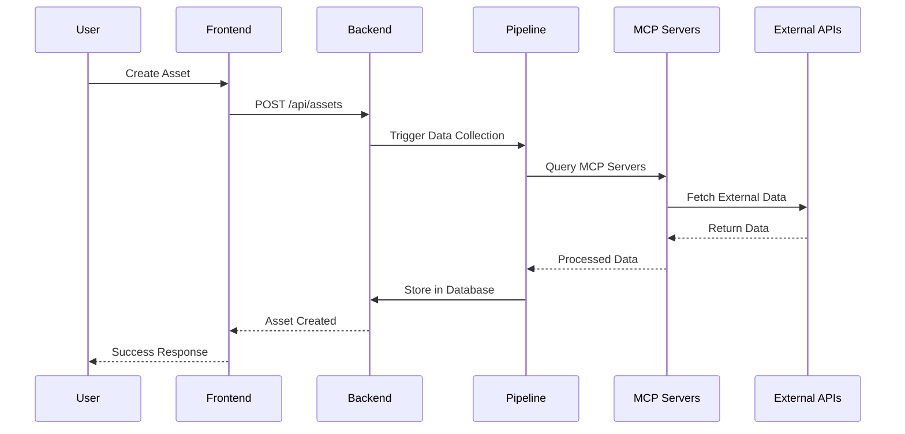
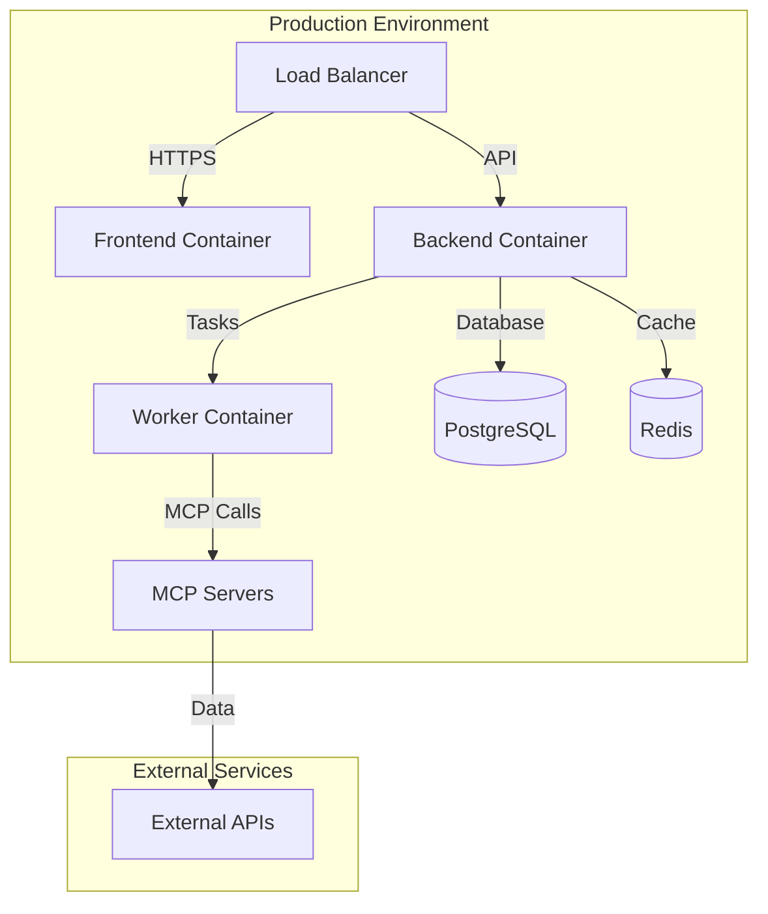

# Nadlaner™ Architecture

## System Overview

Nadlaner™ is a comprehensive real estate intelligence platform built as a microservices architecture with specialized MCP (Model Context Protocol) servers for data collection and a modern web interface for brokers and appraisers.

## High-Level Architecture

## Component Details

### Frontend Layer

**Next.js Application** (`realestate-broker-ui/`)
- **Technology**: Next.js 15, React, TypeScript
- **UI Framework**: Shadcn/ui with Tailwind CSS
- **Key Features**:
  - Asset management dashboard
  - Real-time alerts configuration
  - Mortgage calculator with Bank of Israel integration
  - Interactive analytics with Recharts
  - Mapbox GL integration for property visualization
  - Role-based access control

### Backend Services

**Django REST API** (`backend-django/`)
- **Technology**: Django 5.0, Django REST Framework
- **Key Features**:
  - RESTful API endpoints
  - JWT authentication with Google OAuth
  - Rate-limited asset creation
  - PDF report generation
  - Admin analytics dashboard

**Celery Task Queue**
- **Technology**: Celery with Redis broker
- **Purpose**: Asynchronous data collection and processing
- **Tasks**: Asset data synchronization, alert processing, report generation

**Data Pipeline** (`orchestration/`)
- **Technology**: Python with SQLAlchemy
- **Purpose**: Orchestrates data collection from multiple sources
- **Features**: 
  - Concurrent data collection
  - Error handling and retries
  - Observability with Prometheus metrics
  - Alert system integration

### MCP Servers Layer

The platform uses 5 specialized MCP servers, each providing 4-8 tools for specific data sources:

#### 1. Yad2 MCP Server (`yad2/mcp/`)
- **Purpose**: Real estate listing data from Yad2.co.il
- **Tools**: 7 tools for property search, analysis, and export
- **Data**: Property listings, prices, locations, features

#### 2. GIS MCP Server (`gis/mcp/`)
- **Purpose**: Tel Aviv municipal GIS data
- **Tools**: 12 tools for spatial analysis
- **Data**: Building permits, land use, zoning, safety data

#### 3. Government Data MCP Server (`gov/mcp/`)
- **Purpose**: Government datasets and planning documents
- **Tools**: 6 tools for data access
- **Data**: RAMI plans, nadlan transactions, decisive appraisals

#### 4. Mavat MCP Server (`mavat/mcp/`)
- **Purpose**: National planning portal data
- **Tools**: 10 tools for plan search and document access
- **Data**: Planning documents, regulations, blueprints

#### 5. GovMap MCP Server (`govmap/mcp/`)
- **Purpose**: National mapping and parcel data
- **Tools**: 5 tools for coordinate conversion and parcel lookup
- **Data**: Parcel boundaries, coordinate systems

### Data Flow Architecture

## Data Models

### Core Models

**Asset Model** (`backend-django/core/models.py`)
- Central entity representing a real estate property
- Contains aggregated data from all sources
- Tracks provenance and data quality

**SourceRecord Model**
- Stores raw data from external sources
- Links to specific assets
- Maintains data lineage and timestamps

**Transaction Model**
- Real estate transaction data
- Used for comparable analysis
- Linked to assets for market analysis

### Data Provenance

Each field in the Asset model tracks its source:
- `yad2`: Data from Yad2 listings
- `nadlan`: Government transaction data
- `gis_permit`: Building permit information
- `gis_rights`: Building rights data
- `rami_plan`: Planning document data
- `tabu`: Land registry data

## Technology Stack

### Frontend
- **Framework**: Next.js 15 with App Router
- **Language**: TypeScript
- **Styling**: Tailwind CSS + Shadcn/ui
- **Maps**: Mapbox GL JS
- **Charts**: Recharts
- **State**: React hooks + Context

### Backend
- **Framework**: Django 5.0 + DRF
- **Database**: PostgreSQL 15
- **Cache**: Redis 7
- **Task Queue**: Celery
- **Authentication**: JWT + Google OAuth

### Data Collection
- **MCP Framework**: FastMCP
- **Web Scraping**: Playwright, Selenium, BeautifulSoup
- **API Clients**: Requests, aiohttp
- **Data Processing**: Pandas, SQLAlchemy

### Infrastructure
- **Containerization**: Docker + Docker Compose
- **Monitoring**: Prometheus metrics
- **Logging**: Structured logging with Python logging
- **Testing**: Pytest with comprehensive test coverage

## Security & Compliance

### Data Protection
- JWT-based authentication
- Role-based access control
- Rate limiting on API endpoints
- Secure data storage with encryption

### Scraping Ethics
- Respectful rate limiting
- User-agent identification
- robots.txt compliance
- Data retention policies

### Privacy
- No personal data storage
- Anonymized transaction data
- Secure API communication
- Regular security audits

## Scalability Considerations

### Horizontal Scaling
- Stateless MCP servers
- Load-balanced API endpoints
- Distributed task processing
- Database read replicas

### Performance Optimization
- Redis caching layer
- Database query optimization
- Async data collection
- CDN for static assets

### Monitoring & Observability
- Prometheus metrics collection
- Structured logging
- Health check endpoints
- Performance monitoring

## Deployment Architecture

## Development Workflow

1. **Local Development**: Docker Compose for full stack
2. **Testing**: Comprehensive test suite with fixtures
3. **CI/CD**: Automated testing and deployment
4. **Monitoring**: Real-time metrics and alerting
5. **Documentation**: Auto-generated API docs and guides

This architecture provides a robust, scalable foundation for real estate intelligence while maintaining clean separation of concerns and enabling independent scaling of components.
