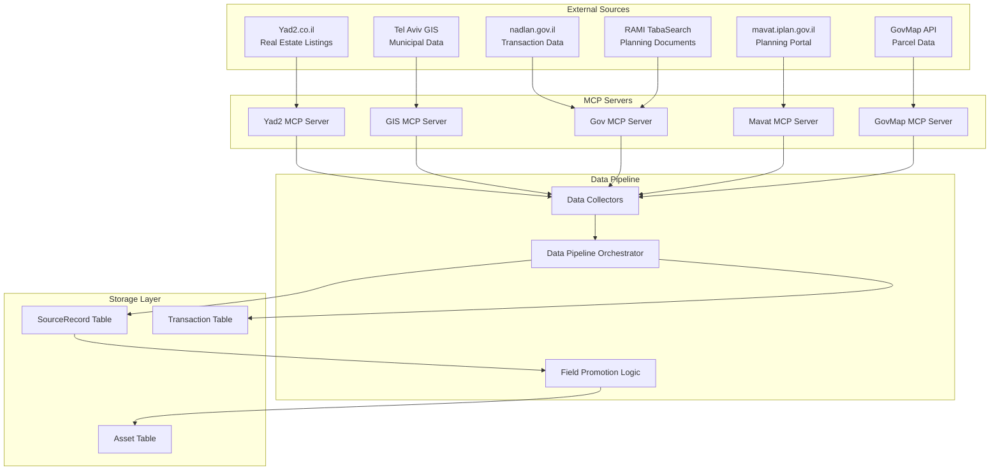

# Data Lineage & Field Provenance

## Overview

This document tracks how data flows from external sources through the MCP servers and data pipeline into the unified Asset model, with complete field-level provenance tracking.

## Data Flow Architecture



## Field Mapping by Source

### Yad2 Data Source (`yad2`)

**Source**: Real estate listings from Yad2.co.il  
**MCP Server**: `yad2/mcp/server.py`  
**Collector**: `orchestration/collectors/yad2_collector.py`

| Asset Field | Yad2 Field | Transformation | Provenance |
|-------------|------------|----------------|------------|
| `city` | `city` | Direct mapping | `yad2` |
| `street` | `street` | Direct mapping | `yad2` |
| `number` | `number` | Direct mapping | `yad2` |
| `area` | `size` or `area` | Direct mapping | `yad2` |
| `rooms` | `rooms` | Direct mapping | `yad2` |
| `bedrooms` | `bedrooms` | Direct mapping | `yad2` |
| `building_type` | `property_type` | Direct mapping | `yad2` |
| `price` | `price` | Direct mapping | `yad2` |
| `price_per_sqm` | Calculated | `price / area` | `yad2` (calculated) |
| `total_area` | `total_size` | Direct mapping | `yad2` |
| `balcony_area` | `balcony_size` | Direct mapping | `yad2` |
| `parking_spaces` | `parking` | Direct mapping | `yad2` |
| `elevator` | `elevator` | Boolean conversion | `yad2` |
| `air_conditioning` | `air_condition` | Boolean conversion | `yad2` |
| `renovated` | `renovated` | Boolean conversion | `yad2` |
| `year_built` | `year_built` | Direct mapping | `yad2` |

**Raw Data Storage**: Stored in `SourceRecord.raw` as JSON with source `"yad2"`

### GIS Data Source (`gis_permit`, `gis_rights`)

**Source**: Tel Aviv municipal GIS system  
**MCP Server**: `gis/mcp/server.py`  
**Collector**: `orchestration/collectors/gis_collector.py`

| Asset Field | GIS Field | Transformation | Provenance |
|-------------|-----------|----------------|------------|
| `lat` | `x`, `y` coordinates | Geocoding conversion | `gis_permit` |
| `lon` | `x`, `y` coordinates | Geocoding conversion | `gis_permit` |
| `block` | `block` data | Extracted from parcel info | `gis_permit` |
| `parcel` | `parcel` data | Extracted from parcel info | `gis_permit` |
| `zoning` | `land_use_main` | Direct mapping | `gis_rights` |
| `building_rights` | `land_use_detailed` | Direct mapping | `gis_rights` |
| `permit_status` | `permits.status` | Status aggregation | `gis_permit` |
| `permit_date` | `permits.date` | Latest permit date | `gis_permit` |

**Raw Data Storage**: Stored in `SourceRecord.raw` as JSON with sources `"gis_permit"` and `"gis_rights"`

### Government Data Sources

#### Nadlan Transactions (`nadlan`)

**Source**: nadlan.gov.il transaction database  
**MCP Server**: `gov/mcp/server.py` (fetch_nadlan_transactions)  
**Collector**: `orchestration/collectors/gov_collector.py`

| Asset Field | Nadlan Field | Transformation | Provenance |
|-------------|--------------|----------------|------------|
| `rent_estimate` | `price` | Calculated from comparable transactions | `nadlan` (calculated) |
| `model_price` | `price` | Statistical model from transactions | `nadlan` (calculated) |
| `confidence_pct` | Multiple fields | Confidence score calculation | `nadlan` (calculated) |

**Raw Data Storage**: Stored in `Transaction` table with source `"nadlan"`

#### RAMI Planning Documents (`rami_plan`)

**Source**: RAMI TabaSearch API  
**MCP Server**: `gov/mcp/server.py` (search_rami_plans)  
**Collector**: `orchestration/collectors/rami_collector.py`

| Asset Field | RAMI Field | Transformation | Provenance |
|-------------|------------|----------------|------------|
| `program` | `plan_name` | Direct mapping | `rami_plan` |
| `lastPermitQ` | `status_date` | Latest plan status | `rami_plan` |
| `remainingRightsSqm` | `building_rights` | Calculated from plan data | `rami_plan` (calculated) |

**Raw Data Storage**: Stored in `SourceRecord.raw` as JSON with source `"rami_plan"`

#### Mavat Planning Data (`mavat`)

**Source**: mavat.iplan.gov.il planning portal  
**MCP Server**: `mavat/mcp/server.py`  
**Collector**: `orchestration/collectors/mavat_collector.py`

| Asset Field | Mavat Field | Transformation | Provenance |
|-------------|-------------|----------------|------------|
| `program` | `plan_title` | Direct mapping | `mavat` |
| `zoning` | `plan_type` | Plan type classification | `mavat` |

**Raw Data Storage**: Stored in `SourceRecord.raw` as JSON with source `"mavat"`

### GovMap Data Source (`govmap`)

**Source**: GovMap national mapping API  
**MCP Server**: `govmap/mcp/server.py`  
**Collector**: Integrated in GIS collector

| Asset Field | GovMap Field | Transformation | Provenance |
|-------------|--------------|----------------|------------|
| `block` | `parcel.block` | Direct mapping | `govmap` |
| `parcel` | `parcel.parcel` | Direct mapping | `govmap` |
| `subparcel` | `parcel.subparcel` | Direct mapping | `govmap` |

**Raw Data Storage**: Stored in `SourceRecord.raw` as JSON with source `"govmap"`

## Data Promotion Logic

The `promote_raw_to_asset()` function in `backend-django/core/models.py` handles field promotion from raw source data to the Asset model:

```python
def promote_raw_to_asset(asset: Asset, raw: dict):
    def set_if_empty(obj, field, value):
        if value in (None, "", [], {}):
            return
        if getattr(obj, field, None) in (None, "", [], {}):
            setattr(obj, field, value)

    # Basic property information
    set_if_empty(asset, "city", raw.get("city"))
    set_if_empty(asset, "street", raw.get("street"))
    set_if_empty(asset, "number", raw.get("number"))
    set_if_empty(asset, "area", raw.get("size") or raw.get("area"))
    set_if_empty(asset, "rooms", raw.get("rooms"))
    set_if_empty(asset, "bedrooms", raw.get("bedrooms"))
    set_if_empty(asset, "building_type", raw.get("property_type"))
    asset.save()
```

## Data Quality & Validation

### Field Validation Rules

1. **Required Fields**: `scope_type`, `city` (for address scope)
2. **Data Type Validation**: Numeric fields must be valid numbers
3. **Range Validation**: Prices, areas, rooms must be positive
4. **Format Validation**: Dates must be valid ISO format

### Data Quality Metrics

- **Completeness**: Percentage of fields populated per source
- **Accuracy**: Validation against known good data
- **Timeliness**: Age of data from source
- **Consistency**: Cross-source field validation

### Error Handling

- **Missing Data**: Logged but doesn't fail the pipeline
- **Invalid Data**: Logged and field remains empty
- **Source Failures**: Retry with exponential backoff
- **Data Conflicts**: Last-write-wins with source priority

## Source Priority & Conflict Resolution

When multiple sources provide data for the same field, the following priority order is used:

1. **Manual Input** (highest priority)
2. **Yad2** (real estate specific)
3. **GIS** (municipal data)
4. **Government** (official records)
5. **Mavat** (planning data)
6. **GovMap** (parcel data)

## Data Retention & Archival

### Retention Policies

- **Source Records**: Retained for 2 years
- **Asset Data**: Retained indefinitely
- **Transaction Data**: Retained for 5 years
- **Raw JSON Data**: Retained for 1 year

### Archival Process

1. **Daily**: Archive old source records
2. **Weekly**: Compress historical data
3. **Monthly**: Generate data quality reports
4. **Quarterly**: Review retention policies

## Monitoring & Observability

### Data Lineage Tracking

- **Field-Level Provenance**: Every field tracks its source
- **Transformation Logging**: All data transformations are logged
- **Quality Metrics**: Real-time data quality monitoring
- **Source Health**: External source availability monitoring

### Alerting

- **Data Quality Degradation**: Alert when quality drops below threshold
- **Source Failures**: Alert when external sources fail
- **Data Conflicts**: Alert when conflicting data is detected
- **Pipeline Failures**: Alert when data pipeline fails

## API for Data Lineage

### Get Field Provenance

```python
# Get provenance for a specific asset field
asset = Asset.objects.get(id=123)
provenance = asset.get_field_provenance('price')
# Returns: {'source': 'yad2', 'confidence': 0.95, 'last_updated': '2024-01-15'}
```

### Get Source Records

```python
# Get all source records for an asset
source_records = asset.source_records.all()
for record in source_records:
    print(f"Source: {record.source}, Data: {record.raw}")
```

### Data Quality Report

```python
# Generate data quality report
report = asset.generate_quality_report()
# Returns: {'completeness': 0.85, 'accuracy': 0.92, 'timeliness': 0.78}
```

This data lineage system ensures complete transparency and traceability of all data in the Nadlaner™ platform, enabling users to understand exactly where their data comes from and how reliable it is.
