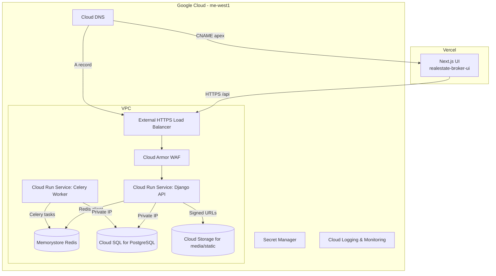

# Production Infrastructure Migration Plan

## Overview

Nadlaner™ customer-facing Next.js UI on Vercel and all other application logic and stateful services to Google Cloud Platform in the `me-west1` (Tel Aviv) region. Django serves the public API, Celery powers background processing, and both workloads run on Cloud Run with private networking to a highly available Cloud SQL PostgreSQL instance and Memorystore Redis. Traffic is terminated by a global HTTPS load balancer protected with Cloud Armor, and Cloud DNS publishes records for both the API and the Vercel-hosted UI.

## End-State Architecture



### Component Responsibilities

| Component | Purpose |
|-----------|---------|
| **Vercel UI** | Hosts the customer-facing Next.js application and forwards authenticated API requests to GCP. |
| **Cloud Run (Django API)** | Serves REST endpoints, handles authentication, and publishes webhook callbacks. Private egress uses a serverless VPC connector. |
| **Cloud Run (Celery Worker)** | Executes asynchronous jobs triggered by Redis/Cloud Tasks and reuses the Django container image configured for worker mode. |
| **Cloud SQL (PostgreSQL)** | Primary transactional database with PITR backups and regional high availability. |
| **Memorystore (Redis)** | Shared broker and cache for Django + Celery with private networking. |
| **HTTPS Load Balancer + Cloud Armor** | Terminates TLS, enforces IP-based allow lists, and routes traffic to the Cloud Run serverless NEG. |
| **Cloud DNS** | Publishes apex CNAME to Vercel and `api.<domain>` A record to the load balancer. |
| **Secret Manager** | Stores sensitive configuration consumed by Cloud Run via environment variables. |

## Deployable Terraform Configuration

Complete, production-ready Terraform for this architecture lives in [`infra/gcp`](../infra/gcp/). Key files:

- `versions.tf` – pins Terraform and Google provider versions.
- `variables.tf` – defines project, image, domain, and secret inputs.
- `main.tf` – provisions VPC networking, serverless VPC connector, Cloud SQL, Memorystore, Cloud Run services for Django API and Celery worker, the HTTPS load balancer with Cloud Armor, and Cloud DNS.
- `outputs.tf` – exposes the load balancer IP, Cloud SQL connection string, and Redis endpoints.

The configuration enables all required Google APIs, creates per-service accounts with Cloud SQL and logging permissions, and injects database + Redis connection details into each Cloud Run workload. The Django service is exposed publicly through the load balancer while the Celery worker remains internal-only.

### Usage

1. Provide container image references, domain settings, and secrets in a `terraform.tfvars` file:

    ```hcl
    project_id        = "nadlaner-prod"
    domain            = "nadlaner.com"
    ui_cname_target   = "cname.vercel-dns.com."
    api_image         = "europe-west1-docker.pkg.dev/nadlaner-prod/app/api:latest"
    worker_image      = "europe-west1-docker.pkg.dev/nadlaner-prod/app/worker:latest"
    db_password       = "change-me"
    allowed_office_cidrs = ["203.0.113.0/24"]
    labels = {
      environment = "production"
      owner        = "nadlaner-platform"
    }
    ```

2. Initialize and apply:

    ```bash
    terraform -chdir=infra/gcp init
    terraform -chdir=infra/gcp apply
    ```

   Terraform will create the VPC, serverless connector, databases, Redis, Cloud Run services, HTTPS load balancer, Cloud Armor policy, and Cloud DNS records required for the end-state architecture.

## Operational Considerations

- **Secrets Management**: Store API keys, Django secret key, and database password in Secret Manager and template them into `api_env_vars` / `worker_env_vars` variables.
- **Static Assets**: Configure Django `STATIC_URL` / `MEDIA_URL` to point at GCS buckets fronted by signed URLs or Cloud CDN.
- **CI/CD**: Build and push container images to Artifact Registry, then trigger `terraform apply` or use Cloud Deploy to roll out new revisions.
- **Monitoring**: Enable uptime checks on the load balancer endpoint and set Cloud Monitoring alerts for request latency, error rates, and database CPU/storage pressure.
