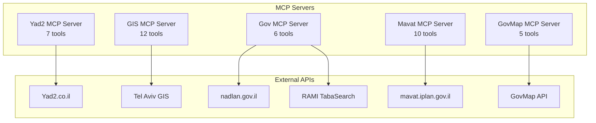

# MCP Tools Catalog

## Overview

Nadlaner™ provides 5 specialized MCP (Model Context Protocol) servers with 40+ tools for comprehensive real estate intelligence. This catalog documents all available tools, their inputs/outputs, rate limits, error modes, and example prompts.

## Server Architecture



---

## 1. Yad2 MCP Server

**Server**: `yad2/mcp/server.py`  
**Dependencies**: `requests`, `beautifulsoup4`, `lxml`, `pandas`  
**Rate Limit**: 1 request/second (respectful scraping)  
**Error Modes**: Network timeout, parsing errors, rate limiting

### Tools

#### `search_real_estate`
**Purpose**: Search for real estate properties with advanced filters  
**Inputs**:
- `maxPrice` (int, optional): Maximum price in NIS
- `minPrice` (int, optional): Minimum price in NIS
- `topArea` (int, optional): Top area code (1=Center, 2=North, etc.)
- `area` (int, optional): Area code
- `city` (int, optional): City code (5000=Tel Aviv)
- `neighborhood` (int, optional): Neighborhood code
- `property` (str, optional): Property types (1=Apartment, 5=House, etc.)
- `rooms` (str, optional): Room count (4+, 3-4, etc.)
- `minRooms` (int, optional): Minimum rooms
- `maxRooms` (int, optional): Maximum rooms
- `parking` (int, optional): Parking spaces (0-5)
- `elevator` (int, optional): Has elevator (0/1)
- `balcony` (int, optional): Has balcony (0/1)
- `renovated` (int, optional): Is renovated (0/1)
- `max_pages` (int): Maximum pages to scrape (default: 3)

**Outputs**:
```json
{
  "total_results": 150,
  "pages_scraped": 3,
  "listings": [
    {
      "title": "דירה 4 חדרים ברמת החייל",
      "price": 2500000,
      "area": 85,
      "rooms": 4,
      "city": "תל אביב",
      "neighborhood": "רמת החייל",
      "url": "https://www.yad2.co.il/item/123456",
      "features": ["מעלית", "חניה", "מרפסת"]
    }
  ],
  "search_url": "https://www.yad2.co.il/realestate/forsale?...",
  "scraped_at": "2024-01-15T10:30:00Z"
}
```

**Example Prompts**:
- "Find 4-room apartments in Tel Aviv under 8M NIS with parking and elevator"
- "Search penthouses in Jerusalem with balcony, renovated, price range 5-15M"
- "Show me houses in Haifa with 3-4 rooms and parking"

#### `build_search_url`
**Purpose**: Generate Yad2 search URLs without scraping  
**Inputs**: Same as `search_real_estate`  
**Outputs**: Complete Yad2 search URL  
**Rate Limit**: None (no external calls)

#### `get_search_parameters_reference`
**Purpose**: Get complete documentation of all search parameters  
**Inputs**: None  
**Outputs**: Detailed parameter reference with 58+ parameters  
**Rate Limit**: None

#### `get_all_property_types`
**Purpose**: Get all available property type codes and names  
**Inputs**: None  
**Outputs**: List of property types with Hebrew/English names and codes  
**Rate Limit**: None

#### `hebrew_to_property_code`
**Purpose**: Convert Hebrew property type names to Yad2 codes  
**Inputs**: `hebrew_name` (str): Hebrew property type name  
**Outputs**: Corresponding Yad2 code  
**Rate Limit**: None

#### `validate_property_type_code`
**Purpose**: Validate property type codes  
**Inputs**: `code` (str): Property type code to validate  
**Outputs**: Validation result with error details if invalid  
**Rate Limit**: None

#### `search_locations`
**Purpose**: Search locations using Yad2 autocomplete API  
**Inputs**: `search_text` (str): Location search query  
**Outputs**: List of matching locations with codes and names  
**Rate Limit**: 10 requests/minute

---

## 2. GIS MCP Server

**Server**: `gis/mcp/server.py`  
**Dependencies**: `requests`, `beautifulsoup4`, `lxml`, `pdfplumber`, `python-dateutil`  
**Rate Limit**: 5 requests/second  
**Error Modes**: Coordinate conversion errors, API timeouts, PDF parsing failures

### Tools

#### `geocode_address`
**Purpose**: Convert address to coordinates (EPSG:2039)  
**Inputs**:
- `street` (str): Street name
- `house_number` (int): House number
- `like` (bool): Use fuzzy matching (default: True)

**Outputs**:
```json
{
  "x": 184320.5,
  "y": 668548.2,
  "srid": 2039
}
```

#### `get_building_permits`
**Purpose**: Find building permits near a point  
**Inputs**:
- `x` (float): X coordinate (EPSG:2039)
- `y` (float): Y coordinate (EPSG:2039)
- `radius` (int): Search radius in meters (default: 30)
- `fields` (list, optional): Specific fields to return
- `download_pdfs` (bool): Download permit PDFs (default: False)
- `save_dir` (str, optional): Directory to save PDFs

**Outputs**:
```json
{
  "count": 3,
  "permits": [
    {
      "permit_number": "2024/12345",
      "address": "רחוב הרצל 15",
      "status": "בביצוע",
      "issue_date": "2024-01-15",
      "pdf_path": "permits/2024_12345.pdf"
    }
  ]
}
```

#### `get_land_use_main`
**Purpose**: Get main land-use categories at a point  
**Inputs**: `x` (float), `y` (float)  
**Outputs**: Land use classification data

#### `get_land_use_detailed`
**Purpose**: Get detailed land-use categories at a point  
**Inputs**: `x` (float), `y` (float)  
**Outputs**: Detailed land use data

#### `get_plans_local`
**Purpose**: Get local/parcel-level plans at a point  
**Inputs**: `x` (float), `y` (float)  
**Outputs**: Local planning data

#### `get_plans_citywide`
**Purpose**: Get city-wide plans at a point  
**Inputs**: `x` (float), `y` (float)  
**Outputs**: City-wide planning data

#### `get_parcels`
**Purpose**: Get parcel information at a point  
**Inputs**: `x` (float), `y` (float)  
**Outputs**: Parcel boundaries and data

#### `get_blocks`
**Purpose**: Get block information at a point  
**Inputs**: `x` (float), `y` (float)  
**Outputs**: Block data

#### `get_dangerous_buildings`
**Purpose**: Find dangerous buildings within radius  
**Inputs**: `x` (float), `y` (float), `radius` (int, default: 80)  
**Outputs**: Dangerous building locations

#### `get_preservation`
**Purpose**: Find preservation-listed buildings within radius  
**Inputs**: `x` (float), `y` (float), `radius` (int, default: 80)  
**Outputs**: Heritage building data

#### `get_noise_levels`
**Purpose**: Get noise levels at a point  
**Inputs**: `x` (float), `y` (float)  
**Outputs**: Noise level data

#### `get_cell_antennas`
**Purpose**: Find cell antennas within radius  
**Inputs**: `x` (float), `y` (float), `radius` (int, default: 120)  
**Outputs**: Cell antenna locations

#### `get_green_areas`
**Purpose**: Find green areas within radius  
**Inputs**: `x` (float), `y` (float), `radius` (int, default: 150)  
**Outputs**: Green space data

#### `get_shelters`
**Purpose**: Find bomb shelters within radius  
**Inputs**: `x` (float), `y` (float), `radius` (int, default: 200)  
**Outputs**: Shelter locations

#### `get_building_privilege_page`
**Purpose**: Download building privilege (זכויות בנייה) page  
**Inputs**: `x` (float), `y` (float), `save_dir` (str, optional)  
**Outputs**: Building rights data and PDF path

---

## 3. Government Data MCP Server

**Server**: `gov/mcp/server.py`  
**Dependencies**: `requests`, `pandas`  
**Rate Limit**: 2 requests/second  
**Error Modes**: API timeouts, authentication failures, data parsing errors

### Tools

#### `decisive_appraisal`
**Purpose**: Fetch decisive appraisal decisions from gov.il  
**Inputs**:
- `block` (str): Block number
- `plot` (str): Plot number
- `max_pages` (int): Maximum pages to scrape (default: 1)

**Outputs**:
```json
{
  "total_results": 25,
  "appraisals": [
    {
      "case_number": "12345/2024",
      "address": "רחוב הרצל 15 תל אביב",
      "appraisal_value": 2500000,
      "date": "2024-01-15",
      "status": "אושר"
    }
  ]
}
```

#### `fetch_nadlan_transactions`
**Purpose**: Fetch real estate transactions from nadlan.gov.il  
**Inputs**:
- `address` (str, optional): Address to search
- `neighborhood_id` (str, optional): Neighborhood ID
- `limit` (int): Maximum results (default: 20)

**Outputs**:
```json
{
  "query_type": "address",
  "address": "רמת החייל",
  "deals_count": 15,
  "deals": [
    {
      "address": "רחוב הרצל 15",
      "price": 2500000,
      "area": 85,
      "rooms": 4,
      "date": "2024-01-15",
      "property_type": "דירה"
    }
  ],
  "source": "nadlan.gov.il"
}
```

#### `search_rami_plans`
**Purpose**: Search planning documents using RAMI TabaSearch API  
**Inputs**:
- `plan_number` (str): Plan number
- `city` (int, optional): City code
- `block` (str): Block number
- `parcel` (str): Plot number
- `statuses` (list, optional): Status codes
- `plan_types` (list, optional): Plan type codes
- `from_status_date` (str, optional): Start date (YYYY-MM-DD)
- `to_status_date` (str, optional): End date (YYYY-MM-DD)

**Outputs**:
```json
{
  "total_records": 5,
  "plans": [
    {
      "plan_id": 12345,
      "plan_number": "תמ״א 38",
      "title": "תכנית מתאר מקומית",
      "status": "מאושר",
      "authority": "עיריית תל אביב",
      "date": "2024-01-15"
    }
  ],
  "search_params": {...}
}
```

#### `download_rami_plan_documents`
**Purpose**: Download documents for a specific plan  
**Inputs**:
- `plan_id` (int): Plan ID
- `plan_number` (str): Plan number
- `base_dir` (str): Save directory (default: "rami_plans")
- `doc_types` (list, optional): Document types to download
- `overwrite` (bool): Overwrite existing files (default: False)

**Outputs**:
```json
{
  "success": true,
  "plan_id": 12345,
  "plan_number": "תמ״א 38",
  "downloaded_files": [
    "rami_plans/תמ״א 38/takanon.pdf",
    "rami_plans/תמ״א 38/tasrit.pdf"
  ],
  "total_files": 2
}
```

#### `get_rami_document_types_info`
**Purpose**: Get information about available document types  
**Inputs**: None  
**Outputs**: Document type descriptions and usage info

---

## 4. Mavat MCP Server

**Server**: `mavat/mcp/server.py`  
**Dependencies**: `requests`  
**Rate Limit**: 3 requests/second  
**Error Modes**: API timeouts, authentication failures, parsing errors

### Tools

#### `search_plans`
**Purpose**: Search for plans matching a free-text query  
**Inputs**:
- `query` (str, optional): Search term
- `city` (str, optional): City name
- `district` (str, optional): District name
- `plan_area` (str, optional): Plan area
- `street` (str, optional): Street name
- `block_number` (str, optional): Block number
- `parcel_number` (str, optional): Parcel number
- `status` (str, optional): Plan status
- `limit` (int): Maximum results (default: 20)
- `page` (int): Page number (default: 1)

**Outputs**:
```json
{
  "total_results": 50,
  "plans": [
    {
      "plan_id": "12345",
      "title": "תכנית מתאר מקומית רמת החייל",
      "status": "מאושר",
      "authority": "עיריית תל אביב",
      "area": "רמת החייל",
      "date": "2024-01-15"
    }
  ],
  "pagination": {
    "current_page": 1,
    "total_pages": 3,
    "has_next": true
  }
}
```

#### `get_plan_details`
**Purpose**: Get detailed information for a specific plan  
**Inputs**: `plan_id` (str): Plan identifier  
**Outputs**: Complete plan information with status, authority, jurisdiction

#### `get_plan_documents`
**Purpose**: Get documents associated with a plan  
**Inputs**: `plan_id` (str): Plan identifier  
**Outputs**: List of available documents with download links

#### `search_by_location`
**Purpose**: Search plans by city/district/street  
**Inputs**: `city` (str), `district` (str, optional), `street` (str, optional)  
**Outputs**: Plans matching location criteria

#### `search_by_block_parcel`
**Purpose**: Search plans by block and parcel numbers  
**Inputs**: `block_number` (str), `parcel_number` (str)  
**Outputs**: Plans matching block/parcel criteria

#### `get_lookup_tables`
**Purpose**: Get all available lookup tables  
**Inputs**: `force_refresh` (bool): Force refresh from API  
**Outputs**: Available lookup tables and their data

#### `get_districts`
**Purpose**: Get available districts  
**Inputs**: None  
**Outputs**: List of districts with codes and names

#### `get_cities`
**Purpose**: Get available cities  
**Inputs**: None  
**Outputs**: List of cities with codes and names

#### `get_streets`
**Purpose**: Get available streets  
**Inputs**: None  
**Outputs**: List of streets with codes and names

#### `search_lookup`
**Purpose**: Search lookup tables by text  
**Inputs**: `query` (str), `table_type` (str)  
**Outputs**: Matching lookup entries

---

## 5. GovMap MCP Server

**Server**: `govmap/mcp/server.py`  
**Dependencies**: `requests`, `pyproj`  
**Rate Limit**: 10 requests/second  
**Error Modes**: Coordinate conversion errors, API timeouts

### Tools

#### `govmap_autocomplete`
**Purpose**: GovMap public autocomplete (no token required)  
**Inputs**: `query` (str): Search query  
**Outputs**: Raw JSON buckets with autocomplete results

#### `govmap_wfs`
**Purpose**: Call WFS GetFeature on an OpenData layer  
**Inputs**:
- `type_name` (str): Layer name
- `cql_filter` (str, optional): CQL filter expression
- `max_features` (int): Maximum features to return (default: 50)

**Outputs**: WFS feature data

#### `govmap_featureinfo`
**Purpose**: WMS GetFeatureInfo around a point  
**Inputs**:
- `layer` (str): Layer name
- `x` (float): X coordinate (EPSG:2039)
- `y` (float): Y coordinate (EPSG:2039)
- `buffer_m` (int): Buffer in meters (default: 5)

**Outputs**: Feature information at the point

#### `govmap_parcel_at_point`
**Purpose**: Get parcel feature at a point  
**Inputs**:
- `x` (float): X coordinate (EPSG:2039)
- `y` (float): Y coordinate (EPSG:2039)
- `type_name` (str): Parcel layer type (default: "opendata:PARCEL_ALL")

**Outputs**: Parcel feature data

#### `govmap_coordinate_conversion`
**Purpose**: Convert coordinates between ITM and WGS84  
**Inputs**:
- `x` (float): X coordinate
- `y` (float): Y coordinate
- `from_crs` (str): Source CRS (ITM/WGS84)
- `to_crs` (str): Target CRS (ITM/WGS84)

**Outputs**: Converted coordinates

---

## Error Handling & Rate Limits

### Common Error Modes

1. **Network Timeouts**: 30-second timeout for all external calls
2. **Rate Limiting**: Exponential backoff with jitter
3. **Authentication Failures**: Retry with fresh tokens
4. **Data Parsing Errors**: Log and continue with partial data
5. **API Quota Exceeded**: Switch to alternative endpoints

### Rate Limit Summary

| Server | Rate Limit | Burst Limit | Retry Strategy |
|--------|------------|-------------|----------------|
| Yad2 | 1 req/sec | 5 req/min | Exponential backoff |
| GIS | 5 req/sec | 50 req/min | Linear backoff |
| Gov | 2 req/sec | 20 req/min | Exponential backoff |
| Mavat | 3 req/sec | 30 req/min | Linear backoff |
| GovMap | 10 req/sec | 100 req/min | No retry needed |

### Error Response Format

```json
{
  "error": true,
  "error_type": "rate_limit_exceeded",
  "message": "Rate limit exceeded for Yad2 API",
  "retry_after": 60,
  "details": {
    "server": "yad2",
    "limit": "1 req/sec",
    "reset_time": "2024-01-15T10:31:00Z"
  }
}
```

## Usage Examples

### Example 1: Complete Property Analysis

```python
# 1. Search for properties
properties = await search_real_estate(
    city="5000",  # Tel Aviv
    property="1",  # Apartments
    rooms="4+",
    maxPrice=8000000
)

# 2. Geocode first property
coords = await geocode_address(
    street=properties[0]["street"],
    house_number=properties[0]["number"]
)

# 3. Get GIS data
permits = await get_building_permits(coords["x"], coords["y"])
zoning = await get_land_use_main(coords["x"], coords["y"])

# 4. Get planning data
plans = await search_rami_plans(
    block=coords["block"],
    parcel=coords["parcel"]
)
```

### Example 2: Market Analysis

```python
# 1. Get comparable transactions
transactions = await fetch_nadlan_transactions(
    address="רמת החייל",
    limit=50
)

# 2. Get decisive appraisals
appraisals = await decisive_appraisal(
    block="6638",
    plot="96"
)

# 3. Analyze price trends
analysis = await analyze_search_results(properties)
```

This comprehensive tool catalog enables powerful real estate intelligence through natural language queries while maintaining respectful rate limits and robust error handling.
